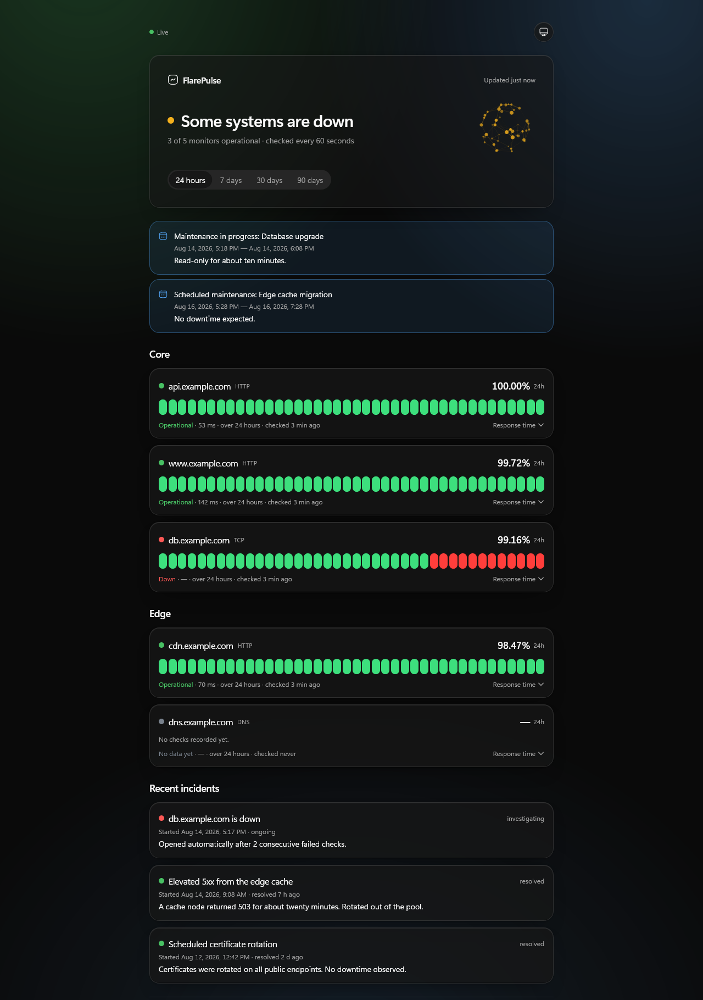
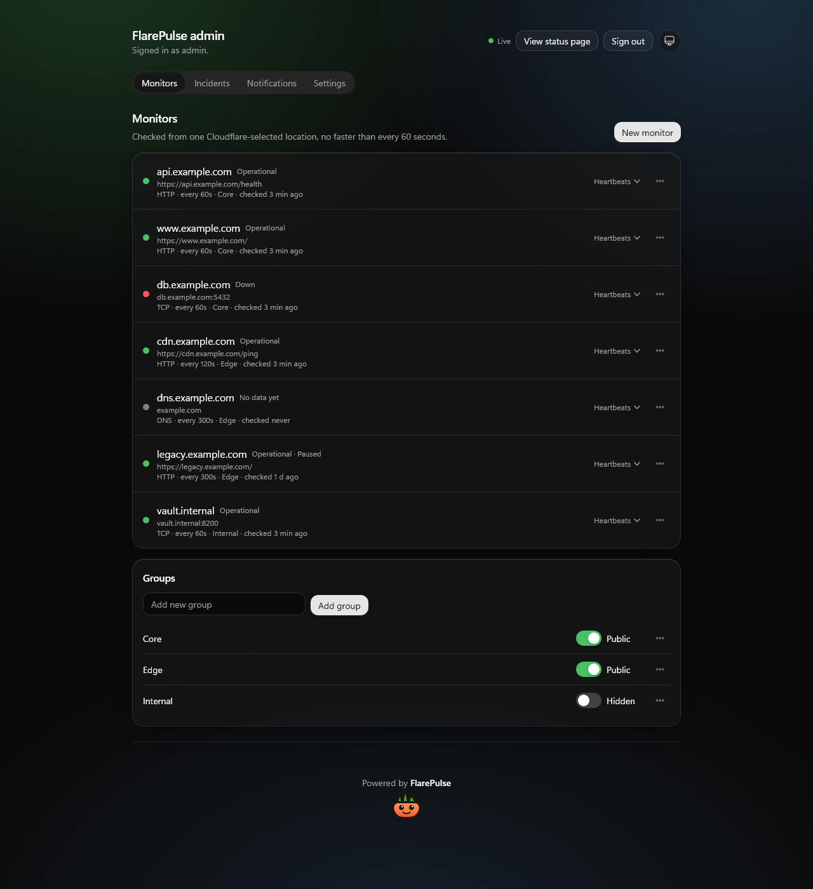

<div align="center">


# FlarePulse

**Uptime monitoring and a public status page, running as one Cloudflare Worker.**

No VM, no managed database service, no second host for the frontend. The React status page and admin panel ship as static assets from the same Worker that serves the API, runs the checker on a cron trigger, and keeps live state in a SQLite-backed Durable Object.

[](https://github.com/EMMeiS/FlarePulse/actions/workflows/ci.yml)
[](LICENSE)
[](https://developers.cloudflare.com/workers/)
[](tests)

[](https://deploy.workers.cloudflare.com/?url=https://github.com/EMMeiS/FlarePulse)

</div>

<table>
<tr>
<td width="50%"></td>
<td width="50%"></td>
</tr>
<tr>
<td align="center"><sub>The public status page</sub></td>
<td align="center"><sub>The admin panel</sub></td>
</tr>
</table>

## Deploy

**One click.** The button above forks this repository into your account, provisions the D1 database and the Durable Object, and deploys. The `deploy` script applies the migrations, so the schema is in place on the first version.

**Or one command**, from a clone:

```bash
npm install
npx wrangler login     # interactive, so it has to be you
npm run setup          # creates the D1 database, writes its id, migrates, deploys
```

`npm run setup` is idempotent: run it again after a code change and it reuses the database, skips applied migrations and uploads a new version. `docs/DEPLOY.md` is the full runbook, including the manual path and what to verify once it is live.

Then **claim `/admin` immediately.** A fresh instance has no admin account and no default credentials — the first visit to `/admin` shows a one-time setup screen that creates the only admin, and that screen closes permanently once it exists. Until you complete it, whoever finds the URL can claim the instance.

FlarePulse needs no secrets. Notification credentials — a Discord webhook URL, a Telegram bot token and chat id — are rows in D1 that you enter through the admin UI, never files in this repository.

## What it does

**Monitors** HTTP(S) endpoints (status code, keyword, inverted keyword), TCP ports and DNS records, each on its own interval with a 60 second floor, a configurable timeout, and a retry window before a monitor is called down.

**A public status page**: overall and per-group status, a heartbeat bar per monitor, uptime and response-time history over 24h/7d/30d/90d, an incident timeline, maintenance banners, and an embeddable SVG badge per monitor. It updates over a WebSocket as each check completes, and says plainly whether it is actually live.

**An admin panel** behind built-in auth: monitor and group CRUD, the live heartbeat view, incidents (manual, plus auto-opened on down and auto-resolved on recovery), maintenance windows, Discord / Telegram / generic-webhook channels with a test send, branding, and a Free-plan quota estimate.

**Group visibility.** A group can be hidden from the public page — the payload the status page receives carries monitor names, never their targets.

## Honest limitations

Real trade-offs of the one-Worker design, not oversights:

- **One vantage point.** Cron triggers run from a Cloudflare-selected location you cannot choose. No multi-region probing — the same single-vantage-point limit as self-hosting on one box.
- **60 second floor on check intervals.** Cron cannot fire more often than once a minute. Intervals are per-monitor, 60s is the minimum, and the UI says so rather than faking finer ones.
- **No ICMP ping.** Workers cannot send raw ICMP, so the monitor types are HTTP(S), TCP port and DNS. A "ping" monitor would have to be faked, so there isn't one.
- **A TCP check proves the handshake, nothing more.** Its accuracy depends on one constant that only a deployed instance can calibrate; `docs/DEPLOY.md` has the measurement.
- **No WAF without a zone.** Rate limiting `/api/live` needs a custom domain. On `workers.dev` the in-code cap of 256 concurrent sockets is the whole story.

## How it works

```
cron * * * * *  ──►  scheduled()  ──►  HTTP / TCP / DNS check  ──►  D1 heartbeats
                          │                                          (7d raw, 90d hourly, 2y daily)
                          └──►  MonitorHub (Durable Object, SQLite)  ──►  WebSocket push  ──►  open pages
```

One Worker serves all of it: `/api/*` hits the Worker, everything else falls back to the built client. Structured data lives in D1 with append-only migrations; live status lives in the Durable Object and is pushed to open dashboards over hibernating WebSockets.

## Commands

Everything except `npm install` and the deploy runs offline.

```bash
npm install         # once
npm run dev         # Vite dev server, Worker running in workerd
npm run demo        # seed the local database with demo data, then run the dev server
npm test            # Vitest inside workerd against real D1 and Durable Object bindings
npm run typecheck   # app + test tsconfigs
npm run build       # client -> dist/client, Worker -> dist/flarepulse
npm run setup       # first deploy: create D1, write its id, migrate, deploy
npm run db:migrate  # apply migrations to the remote database
npm run deploy      # migrate, build, upload
npm run cf-typegen  # regenerate worker-configuration.d.ts after editing wrangler.jsonc
```

## Layout

| Path | What lives there |
| --- | --- |
| `src/` | Worker entry: Hono routes, the `scheduled()` checker, the Durable Object |
| `frontend/` | React client (Tailwind v4, shadcn/ui primitives, ReUI blocks, Reicon icons) |
| `migrations/` | D1 schema migrations, append-only |
| `tests/` | Vitest suites, run in workerd against real bindings |
| `scripts/setup.mjs` | The one-command first deploy |
| `scripts/demo.mjs` | Seeds the local database and an admin account for a demo run |
| `docs/` | `DEPLOY.md` runbook, `DECISIONS.md` log, `DEMO.md` walkthrough |
| `wrangler.jsonc` | The single Worker config: assets, D1, Durable Object, cron trigger |

## Stack

TypeScript throughout. [Hono](https://hono.dev) on Workers, React 19 + [Vite](https://vite.dev) + Tailwind v4 for the client, D1 for structured data, a SQLite-backed Durable Object for live state, and Vitest with `@cloudflare/vitest-pool-workers` so the tests run in the same runtime as production. Everything v1 needs fits the Workers **Free** plan.

## Docs

- [`docs/DEPLOY.md`](docs/DEPLOY.md) — deploy runbook, verification steps, rollback, recovery
- [`docs/DEMO.md`](docs/DEMO.md) — what `npm run demo` puts on screen
- [`docs/DECISIONS.md`](docs/DECISIONS.md) — the decision log: what was chosen, and why

## License

[MIT](LICENSE) © EMMeiS

